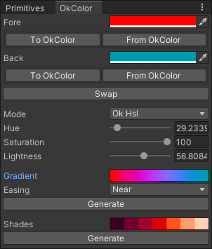

# UnityOkHsl

This repo contains a set of C# scripts intended for use with [Unity](https://unity.com/), a game development engine. These scripts adapt and wrap [Okhsl](https://bottosson.github.io/posts/colorpicker/) to provide a basic color picker. Okhsl is a color representation developed by Bjorn Ottosson to create an alternative to HSL that is based on human perception. Those interested in an interactive comparison between Okhsl, HSLuv and traditional HSL may reference this [link](https://bottosson.github.io/misc/colorpicker/).

## Installation

All C# scripts should be placed in a Unity project's `Assets` folder. Those who wish to use `OkColorMenu.cs` should place it in the `Assets\Editor` folder.

## Usage

Once the scripts have been successfully installed, go to `Window > OkColor` to open the OkColor editor window. Depending on the `Mode`, sliders in the editor can be used to create a color in either `OkLab`, `OkHsl` or `OkHsv`. Select `From OkColor` to update the built-in Unity color pickers.

The `Generate` button updates a Unity `Gradient` according to the `Fore` and `Back` colors. The angular easing direction can be selected for `OkHsl` and `OkHsv`. Unity gradients permit up to 8 color keys, so the approximation of an OkColor gradient is not exact.

The hue for grays is left at zero to follow convention. This will cause problems when, for example, creating a gradient from a gray to a saturated color or when sorting colors by hue. For that reason, if either `Fore` or `Back` colors are gray, then gradient generation will default `OkLab`.

Beware that discontinuities develop at high saturation, particularly around darker blues, such as `#0306FF` (in OkHsl, `264.2793` hue, `100` saturation, `36.92266` lightness).

## Changes

The original code has been modified to handle edge cases for black, white and grays. There are some measures to prevent the passing of invalid values to division or square-root. The C# implementation uses double-, rather than single-, precision (`double`s instead of `float`s). Furthermore, it uses tuples to avoid specialized `struct`s. Unused methods have been removed.

## License

This repository uses the MIT License associated with the original implementation in C++ in Ottosson's article.

> Copyright(c) 2021 Bjorn Ottosson
>
> Permission is hereby granted, free of charge, to any person obtaining a copy of
> this software and associated documentation files(the "Software"), to deal in
> the Software without restriction, including without limitation the rights to
> use, copy, modify, merge, publish, distribute, sublicense, and/or sell copies
> of the Software, and to permit persons to whom the Software is furnished to do
> so, subject to the following conditions:
>
> The above copyright notice and this permission notice shall be included in all
> copies or substantial portions of the Software.
>
> THE SOFTWARE IS PROVIDED "AS IS", WITHOUT WARRANTY OF ANY KIND, EXPRESS OR
> IMPLIED, INCLUDING BUT NOT LIMITED TO THE WARRANTIES OF MERCHANTABILITY,
> FITNESS FOR A PARTICULAR PURPOSE AND NONINFRINGEMENT. IN NO EVENT SHALL THE
> AUTHORS OR COPYRIGHT HOLDERS BE LIABLE FOR ANY CLAIM, DAMAGES OR OTHER
> LIABILITY, WHETHER IN AN ACTION OF CONTRACT, TORT OR OTHERWISE, ARISING FROM,
> OUT OF OR IN CONNECTION WITH THE SOFTWARE OR THE USE OR OTHER DEALINGS IN THE
> SOFTWARE.